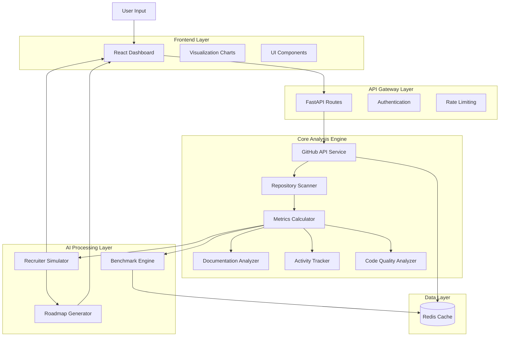
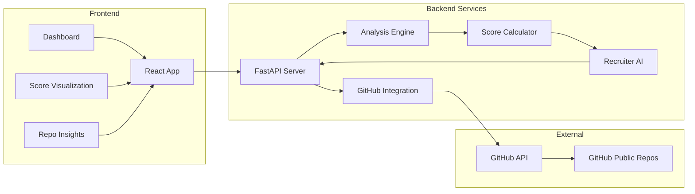

# GitHub Portfolio Analyzer & Enhancer

  
  
  

 

  <h3>🚀 Transform your GitHub profile into a recruiter-ready portfolio</h3>
  
Automated analysis • Portfolio Scoring • AI Recruiter Simulation • Improvement Roadmaps

---

##  Overview

**GitHub Portfolio Analyzer & Enhancer** is an intelligent tool designed to help students and early-career developers optimize their GitHub profiles for recruitment. Most GitHub profiles fail to effectively communicate real skills, project impact, and development consistency to recruiters due to poor documentation, unstructured repositories, and unclear commit history.

Our solution automatically analyzes GitHub profiles, evaluates repositories using recruiter-relevant metrics, generates a comprehensive Portfolio Score, and provides actionable recommendations to transform a simple code storage platform into a powerful, recruiter-ready portfolio.

###  Key Features

| Feature | Description |
|---------|-------------|
| **Automated Profile Analysis** | Scans public GitHub profiles using GitHub API |
| **Portfolio Scoring** | Generates overall and component-wise scores (Documentation, Code Quality, Consistency, Impact, Depth) |
| **Repository Insights** | Individual scores and improvement suggestions for each repo |
| **Strengths & Red Flags** | Identifies what to showcase and what to fix |
| **AI Recruiter Simulation** | First impression, hire/maybe/reject decision, interview questions |
| **Improvement Roadmap** | Step-by-step plans for 7, 30, and 90 days |
| **Benchmark Comparison** | Compare with average and top-performing profiles |

---

##  System Architecture

### High-Level Architecture

## Component Architecture

